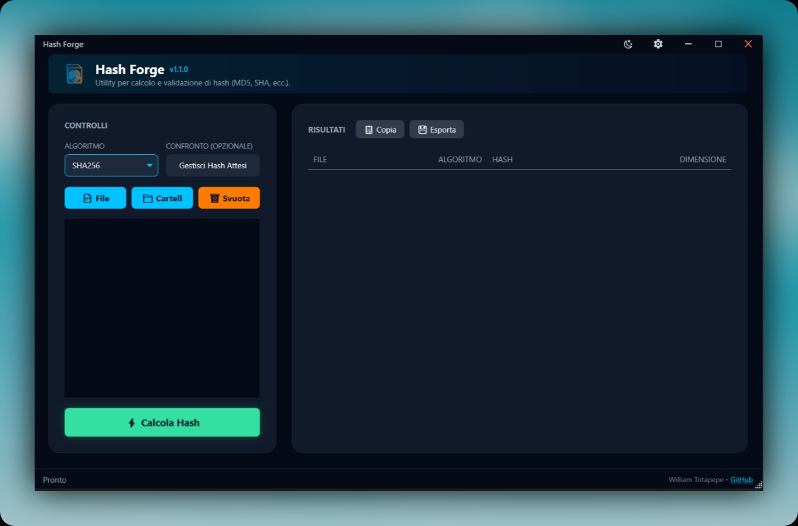
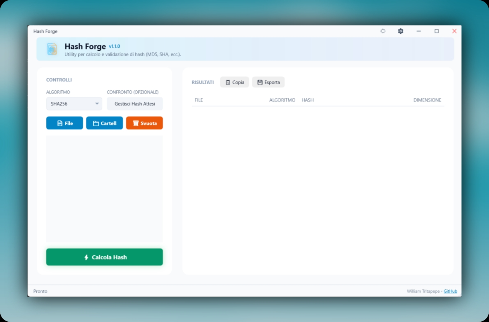

# Hash Forge

Hash Forge è un’utility professionale e ad alte prestazioni per il calcolo e la validazione degli hash di file e cartelle su Windows.  
Offre un’interfaccia moderna (tema chiaro e scuro), supporta i principali algoritmi di hashing ed è pensata per semplificare sia i controlli rapidi sia i flussi di verifica più avanzati.

## 📸 Demo (Tema Chiaro e Scuro)

  
  

## ✨ Caratteristiche principali

- **Algoritmi supportati**: MD5, SHA1, SHA224, SHA256, SHA512  
- **Calcolo multiplo**: supporto per file singoli e intere cartelle
- **Drag & Drop**: trascina file e cartelle direttamente nella finestra principale
- **Verifica hash**: confronto automatico tra hash calcolati e hash attesi
- **Gestione liste di hash**:
  - overlay dedicato per incollare o gestire liste di hash attesi
  - caricamento da file `.txt`, `.md5`, `.sha1`, `.sha256` con parsing automatico
  - colonna di stato con esito della verifica (OK / NO)
- **Esportazione risultati**:
  - esportazione in formati standard (`.md5`, `.sha1`, `.sha256`, ecc.)
- **Tema chiaro/scuro**:
  - cambio tema con un click
  - persistenza della preferenza tra le sessioni
- **Integrazione con Windows**:
  - voce dedicata nel menu contestuale di Esplora risorse per un accesso rapido
- **Prestazioni**:
  - elaborazione ottimizzata per gestire più file in maniera fluida

## 📥 Download

Le versioni compilate di Hash Forge sono disponibili nella sezione **Releases** del repository:

👉 [Vai alle Releases](https://github.com/Trita-a/HashForge/releases)

Scarica l’ultima versione disponibile (`HashForge.exe`) dalla sezione **Assets**.

## 🚀 Installazione

Hash Forge è una **applicazione portabile**:

1. Scarica `HashForge.exe` dalla pagina delle release.
2. Copia il file in una cartella a tua scelta (ad es. `C:\Programmi\HashForge`).
3. Avvia `HashForge.exe`.  
   Non è richiesta alcuna installazione tradizionale.

Per un accesso ancora più rapido puoi:

- aggiungere Hash Forge alla barra delle applicazioni;
- configurare l’integrazione con il menu contestuale di Windows (se disponibile nella versione utilizzata).

## 🧩 Utilizzo rapido

1. **Aggiungi file o cartelle**:
   - trascina uno o più file/cartelle nella finestra di Hash Forge  
   - oppure utilizza i pulsanti *Aggiungi File* / *Aggiungi Cartella*
2. **Seleziona l’algoritmo di hashing** (MD5, SHA1, SHA224, SHA256, SHA512).
3. Premi **Avvia** per iniziare il calcolo degli hash.
4. Consulta la tabella dei risultati:
   - percorso del file
   - hash calcolato
   - eventuale stato di verifica (se sono stati definiti hash attesi)
5. Esporta i risultati nei formati supportati, se necessario.

## 📋 Gestione hash multipli (overlay)

Per scenari in cui devi verificare molti hash in una volta sola, Hash Forge offre un overlay dedicato:

- Clicca sul pulsante **Gestisci Hash Attesi**.
- Incolla una lista di hash o carica un file di hash (`.txt`, `.md5`, `.sha1`, `.sha256`).
- Il contenuto viene analizzato automaticamente e associato ai file processati.
- Nella tabella principale comparirà una **colonna di stato** con l’esito della verifica per ciascun file.
- Quando sono presenti hash attesi:
  - il pulsante mostra un conteggio e un feedback visivo (es. colore verde) per indicare che la lista è attiva.

Questa modalità è ideale per:

- confrontare hash forniti da terze parti;
- verificare integrità di backup;
- controllare grandi set di file scaricati.

## 🎨 Tema chiaro e scuro

Hash Forge supporta sia **tema scuro** che **tema chiaro**:

- il tema può essere cambiato in qualsiasi momento dall’interfaccia;
- la scelta viene **salvata** e ripristinata alle aperture successive.

## 💻 Requisiti di sistema

- **Sistema operativo**: Windows 7 o superiore (64 bit consigliato)
- **Runtime**: .NET Framework 4.7.2 o superiore  
  (già incluso in Windows 10/11 nella maggior parte delle installazioni)

## 🤝 Contributi & Segnalazione problemi

Al momento il progetto è sviluppato e mantenuto dall’autore originale, ma:

- puoi aprire una **Issue** per:
  - segnalare bug
  - proporre nuove funzionalità
  - suggerire miglioramenti all’interfaccia o alle performance
- se desideri contribuire con codice, puoi proporre una **Pull Request** descrivendo chiaramente:
  - il problema che risolvi
  - la soluzione implementata
  - eventuali note per i test

## 👤 Autore

Hash Forge è ideato e sviluppato da **William Tritapepe**.

- **Email**: william.trita@gmail.com

## 📄 Licenza

Questo progetto è distribuito sotto licenza **MIT**.  
Per tutti i dettagli consulta il file [LICENSE](./LICENSE).
