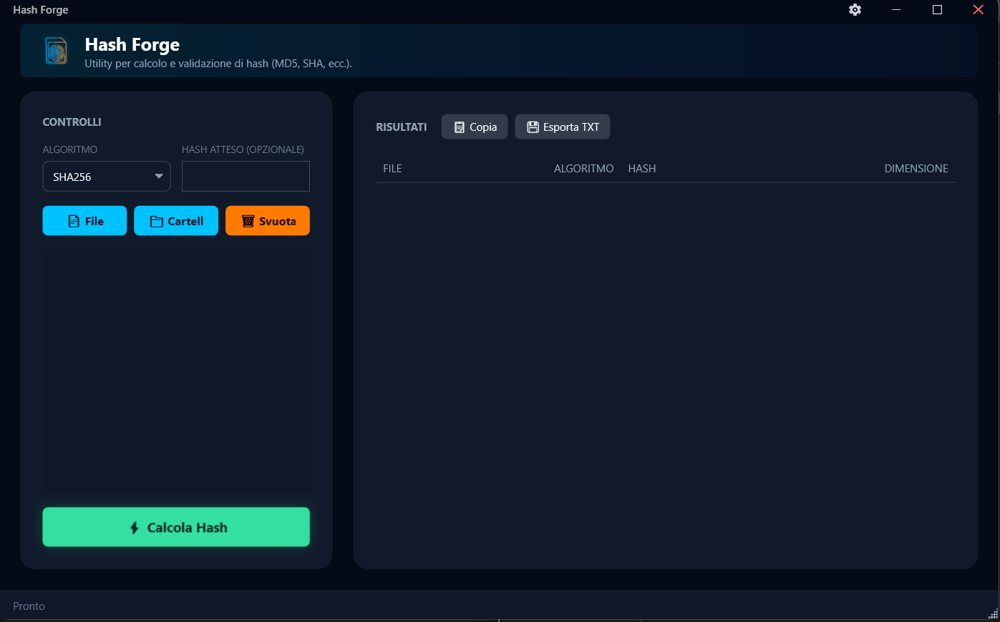

# Hash Forge

**Hash Forge** è uno strumento professionale e veloce per il calcolo degli hash di file e cartelle su Windows. Progettato con un'interfaccia moderna e intuitiva, supporta molteplici algoritmi di hashing e offre funzionalità avanzate come il confronto degli hash e l'esportazione dei risultati.

## Funzionalità

*   **Algoritmi Supportati**: MD5, SHA1, SHA224, SHA256, SHA512.
*   **Interfaccia Moderna**: Design scuro, pulito e reattivo.
*   **Calcolo Multiplo**: Supporto per file singoli e intere cartelle.
*   **Drag & Drop**: Trascina file e cartelle direttamente nell'applicazione.
*   **Verifica Hash**: Confronta automaticamente l'hash calcolato con uno atteso.
*   **Esportazione**: Salva i risultati in formato testo.
*   **Integrazione Shell**: Aggiungi "Hash Forge" al menu contestuale di Windows per un accesso rapido.

## Autore e Crediti

Questo progetto è stato ideato e sviluppato da **William Tritapepe**.

*   **Autore**: William Tritapepe
*   **Contatto**: [william.trita@gmail.com](mailto:william.trita@gmail.com)

## Licenza

Il codice sorgente è disponibile pubblicamente, ma tutti i diritti rimangono dell'autore.
Vedi il file [LICENSE](LICENSE) per i dettagli.

Copyright © 2025 William Tritapepe.
