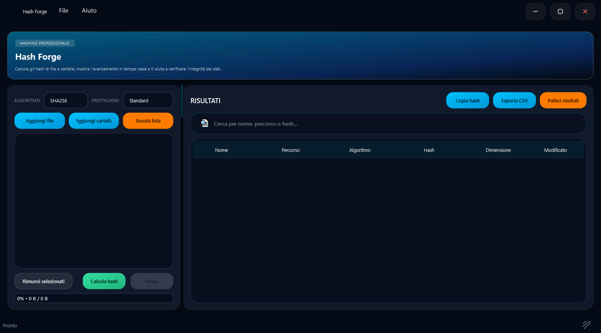

# Hash Forge

Hash Forge è un'app desktop basata su PySide6 che calcola hash crittografici per file e cartelle (MD5, SHA*, SHA3, BLAKE2) e offre un flusso completamente visivo per verificare l'integrità dei dati.



## Funzionalità principali

- Drag & drop di file e directory con deduplicazione automatica.
- Scelta rapida dell'algoritmo di hashing e dei profili prestazionali (1/4/16 MiB).
- Barra di avanzamento in tempo reale con ETA calcolata sui byte processati.
- Tabella dei risultati con copia multipla negli appunti ed esportazione CSV.
- Generatore di icone personalizzate (normalizzazione artwork o icona procedurale).

## Requisiti

- Windows 10/11 con Python 3.11 o superiore.
- Dipendenze elencate in `requirements.txt`.
- (Opzionale) PyInstaller per creare l'eseguibile standalone.

## Installazione rapida

```powershell
cd path\to\hash-forge
python -m venv .venv
.\.venv\Scripts\Activate.ps1
pip install -r requirements.txt
```

## Avvio dell'applicazione

```powershell
.\.venv\Scripts\Activate.ps1
python -m src.app
```

Per un entrypoint più semplice è disponibile anche `run_app.py`:

```powershell
python run_app.py
```

## Compilare un eseguibile standalone

1. Assicurati che la virtualenv sia attiva e che PyInstaller sia installato (`pip install pyinstaller`).
2. Esegui il build script già configurato:

```powershell
python -m PyInstaller --clean --noconfirm HashForge.spec
```

L'eseguibile verrà posizionato in `dist/HashForge/HashForge.exe` e includerà icone e dipendenze Qt.

## Rigenerare l'icona

### Artwork personalizzato

1. Sovrascrivi `icon.png` con il nuovo PNG (anche ad alta risoluzione).
2. Esegui:

```powershell
python tools/prepare_custom_icon.py
```

Lo script effettua crop, centratura, margine e genera automaticamente:

- `icon.png` (app)
- `icon.ico` (bundled nell'eseguibile)
- `assets/icon_preview.png`
- `assets/icon_original.png` (backup dell'input)

### Icona procedurale

Per la versione disegnata via script:

```powershell
pip install pillow
python tools/generate_icon.py
```

## Struttura del progetto

```
assets/
  hashforge-ui.png      # screenshot incluso nel README
  icon_preview.png      # anteprima icona corrente
  icon_original.png     # backup generato dallo script
HashForge.spec
README.md
icon.ico
icon.png
requirements.txt
run_app.py
src/
tests/
tools/
```

La directory `src/` contiene i moduli dell'interfaccia (`app.py`), logica di hashing (`hash_utils.py`), modelli (`models.py`), stili (`styles.py`) e worker thread (`workers.py`).

## Test

```powershell
.\.venv\Scripts\Activate.ps1
pytest
```

## Crediti

Hash Forge è ideato e curato da **William Tritapepe**, autore dell'interfaccia e del flusso di hashing.
